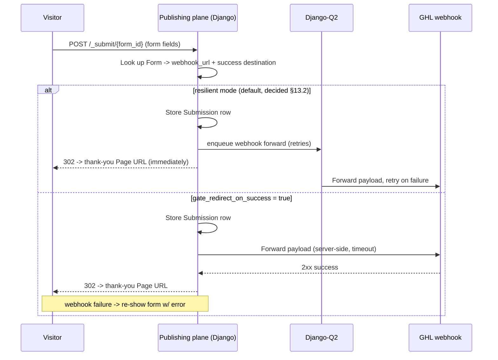

# ARCHITECTURE.md — Landing Page Platform ("HTML-in, editable-out")

> Spec for building the system in Claude Code. Django + PostgreSQL.
> Purpose: ingest static HTML (exported from GoHighLevel), turn it into a
> structured, non-technical-editable page, host it on subdomains (and later
> custom domains), with first-class countdown timers and multi-page funnels.
>
> **Scope: SINGLE CLIENT.** One client's team creates and manages many landing
> pages and funnels of their own. No multi-tenancy — no org/tenant isolation.

---

## 1. What we're building (one-paragraph summary)

A lightweight CMS for **one client** that operates on **imported HTML** rather
than a native block model. The client brings HTML — pasted, uploaded, or fetched
by URL — from **their own authoring process** (this replaces the earlier
GoHighLevel-export assumption; the pipeline is source-agnostic and targets rich,
custom-authored pages). An **annotation pipeline** (deterministic parser + a
single OpenAI pass) marks which regions are editable and what type they are. Their non-technical team members then
edit those regions through labeled form fields and a live preview. Pages are
grouped into funnels (Site → Pages) so a landing page can hand off to its own
thank-you page. Published pages are rendered to near-static HTML and served from
subdomains via CDN.

---

## 2. Core design principle (read this first)

**The LLM annotates once, at import, and never emits HTML.**

This single decision keeps the system reliable and cheap. Everything else falls
out of it.

- OpenAI is called **once per import** (cacheable), never at edit or render time.
- OpenAI **never rewrites or generates markup**. It only receives a stripped DOM
  skeleton and returns **JSON references + metadata** (which elements are
  editable, their labels, field types, groups).
- All markup mutation is done deterministically in Python (lxml/BeautifulSoup).
- Worst case for a hallucinating model = a mislabeled field a human corrects —
  it can never corrupt the page structure.

Editing and rendering are pure Python string/DOM operations. No AI on the hot path.

---

## 3. Goals / Non-goals

**Goals (v1)**
- Single client, many sites/pages/funnels. Simple user accounts, no tenant boundary.
- Import GHL HTML (paste/upload/URL) → editable page without touching code.
- Subdomain hosting with automatic TLS.
- **Multi-page funnels:** form submit → per-LP thank-you page (see §11).
- First-class, user-friendly countdown timers (fixed + evergreen).
- Draft → publish flow with version history and rollback.
- Asset rehosting (don't hotlink GHL's CDN).
- Minimal lead ledger: every submission stored (`Submission`: payload + webhook
  status/attempts) as backup + retry visibility. Dashboards/exports are v2.

**Non-goals (v1 — plan for later)**
- Multi-tenancy / serving multiple separate clients. (Not needed. Don't build it.)
- Native drag-and-drop page builder (we edit imported HTML, not build from scratch).
- Lead dashboards/exports (v1 stores a minimal `Submission` ledger; UI on top is v2).
- Automatic GHL API sync (v1 is manual paste/upload; API pull is a later connector).
- A/B testing, reusable global blocks, re-import diff-merge (all v2+).

---

## 4. Assumptions (confirm before/while building)

These are baked into the design; change them here if wrong.

1. **Single client, no tenancy.** Users are the client's team members (Django auth
   + optional simple role). No `Organization`, no per-tenant query scoping, no RLS.
2. **Site → Page structure = a funnel.** A `Site` owns a subdomain and holds one or
   more `Page`s (`promo.clientdomain.com/` = LP, `/thank-you` = thank-you page). A
   standalone lander = a Site with one Page.
3. **Forms = server-side submit proxy.** v1 rewrites the imported `<form action>`
   to point at our publishing plane; we forward the payload to the configured GHL
   webhook and 302-redirect to the wired thank-you Page. This is what enables
   per-LP thank-you routing (see §11). Every submission is also written to the
   `Submission` ledger (decided §13.1) — backup + retry bookkeeping, no UI in v1.
4. **Custom domains** land in v2; v1 ships subdomains only, but the domain model
   supports them from day one.
5. **Tracking pixels / GTM** are handled as managed per-page/per-site script
   fields, not by trusting arbitrary inline `<script>` from the import.
6. HTML is the client's own (trusted), but we still sanitize imported scripts and
   keep the editor session off published subdomains — hygiene, see §12.

---

## 5. High-level architecture

```mermaid
flowchart TB
    subgraph Client
        U[Client team member / editor]
        V[Public visitor]
    end

    subgraph Edge["Reverse proxy (Caddy) + CDN (Cloudflare)"]
        RP[TLS termination + host routing]
    end

    subgraph Control["Control plane (Django)"]
        ED[Editor + Admin API<br/>auth required]
    end

    subgraph Publish["Publishing plane (Django)"]
        PUB[Public page server<br/>GET = static blob]
        SUB[/_submit/&#123;form_id&#125;<br/>POST = dynamic/]
    end

    subgraph Workers["Django-Q2 cluster (qcluster)"]
        IMP[Import + annotate + rehost jobs]
        HK[Webhook forward + retry]
    end

    DB[(PostgreSQL)]
    RED[(Redis: cache + broker)]
    OBJ[(Object storage: R2/S3<br/>assets + rendered pages)]
    OAI[OpenAI API<br/>annotation only]
    GHL[GHL webhook]

    U --> RP --> ED
    V --> RP --> PUB
    V --> RP --> SUB
    ED --> DB
    ED -- enqueue --> RED
    IMP --> RED
    IMP --> DB
    IMP --> OBJ
    IMP --> OAI
    SUB --> DB
    SUB -- enqueue/forward --> HK
    HK --> GHL
    PUB --> RED
    PUB --> OBJ
    PUB --> DB
```



**Two logical planes, one Django project:**
- **Control plane** (`app.yourdomain.com`) — auth-gated editor + admin. Session
  cookies scoped to this host ONLY.
- **Publishing plane** (`*.yourdomain.com` + future custom domains) — public.
  Page GETs are cache-first static blobs; the `/_submit/{form_id}` POST is dynamic.

Keep them as separate Django apps in one project; they can be split later.

---

## 6. Request routing

A `HostRouterMiddleware` resolves the `Host` header on every request:

- `app.yourdomain.com` → control plane (editor/admin).
- `{subdomain}.yourdomain.com` → look up `Site` by subdomain → publishing plane.
- custom domain (v2) → look up `Domain` by hostname → `Site`.
- Unknown host → 404 (do not leak).

Use a plain custom middleware rather than `django-hosts` — clearer, and you
control the caching. Resolved `site` is attached to `request.site`.

**Infra:** wildcard DNS `*.yourdomain.com` → app. Caddy handles wildcard TLS and
**on-demand TLS** for future custom domains. This is why Caddy > Nginx+Certbot here.

---

## 7. The import + annotation pipeline (the heart of the system)

Runs async via Django-Q2. Tracked by an `ImportJob` row (status, tokens, cost, error).

```mermaid
sequenceDiagram
    participant U as User
    participant D as Django (control)
    participant W as Django-Q2 worker
    participant O as OpenAI
    participant S as Object storage

    U->>D: Paste / upload GHL HTML (or URL)
    D->>D: Store raw HTML (ImportSource)
    D->>W: enqueue import job
    W->>W: 1. Parse DOM (lxml)
    W->>S: 2. Rehost assets (imgs, css url(), bg images) + rewrite URLs
    W->>W: 3. Stamp every element: data-anno-tmp="uuid"
    W->>W: 4. Build stripped DOM skeleton (tags, classes, temp-ids, truncated text)
    W->>O: 5. Skeleton -> "return JSON: editable regions + metadata"
    O-->>W: JSON: [{tmp_id, label, field_type, group}, ...]
    W->>W: 6. Map tmp_ids -> nodes; swap to stable data-editable-id
    W->>W: 7. Extract current content as initial FieldValues
    W->>W: 8. Detect + convert countdowns + forms to managed components
    W->>D: Save PageVersion (template_html + annotation_map + field_values)
    D-->>U: Review screen (confirm / rename / add / remove fields)
```

**Step details that matter:**

- **Step 2 — rehost assets.** Find ``, `srcset`, inline
  `style="background:url(...)"`, and external stylesheets. Download → object
  storage (dedupe by content hash) → rewrite URLs. Guard against **SSRF** (block
  internal IPs/metadata endpoints, validate content-type/size).
- **Step 4 — the skeleton.** Strip `<script>`/`<style>` bodies and long
  attributes. Send only structure: tag, id/class, `data-anno-tmp`, truncated inner
  text, and cheap hints (is it an ``, `<a>`, `<form>`, or countdown-like text
  such as `00:00:00`). Keeps tokens low and output focused.
- **Step 5 — force the schema.** Use OpenAI **structured outputs / JSON schema**
  (`response_format`) so the model can only return valid field objects. Chunk very
  large pages by top-level children of `<body>`, then merge. Per region:
  ```json
  {
    "tmp_id": "a1b2",
    "label": "Hero headline",
    "field_type": "text",
    "group": "Hero",
    "notes": ""
  }
  ```
  `field_type` ∈ text | richtext | image | link_url | link_text | cta | countdown
  | **form** | background_image | color | visibility | meta_title | meta_description.
- **Step 6 — materialize.** Deterministically map each `tmp_id` back to its node
  and replace with a stable `data-editable-id="hero-headline"` (slugified,
  collision-safe). Strip remaining `data-anno-tmp`. Store the **template HTML**
  separately from the **field values**.
- **Step 8 — countdowns + forms.** Replace GHL's countdown widget with your
  managed markup (§9). Detect `<form>` and create a `Form` record + rewrite its
  action to `/_submit/{form_id}` so you own submission and redirect (§11).

**Editing loop (no AI):** load template + field values → render live preview in a
**sandboxed iframe** → side panel of grouped, typed fields → clicking an element
in the preview scrolls to its field via `postMessage` keyed on `data-editable-id`.
Edits mutate draft `field_values`. Autosave, versioned.

**Rendering/publish (no AI):** inject `field_values` into their `data-editable-id`
nodes (pure lxml patch) → inject countdown runtime + config, rewrite form actions,
inject managed tracking scripts → produce final HTML → write to object storage
under a version key → invalidate CDN. Rollback = repoint the published pointer.

---

## 8. Data model (PostgreSQL)

Concrete enough to scaffold `models.py`. IDs = UUID PKs. No tenant scoping — one
client, so rows are just global.

| Model | Key fields | Notes |
|---|---|---|
| `User` | Django auth user, optional `role` (admin/editor/viewer) | The client's team. |
| `Site` | subdomain (unique), name, default_head_scripts, default_body_scripts | Subdomain-hosted funnel. |
| `Domain` | site FK, hostname (unique), is_primary, tls_status | Subdomain now; custom domains v2. |
| `Page` | site FK, path/slug, status, seo_title, seo_description, og_image, draft_version FK, published_version FK | A single URL within a Site. |
| `ImportSource` | page FK, raw_html (text), source_type (paste/upload/url/ghl_api), created_at | Immutable record of input. |
| `ImportJob` | page FK, status, error, llm_tokens, cost_cents, finished_at | Async tracking. |
| `PageVersion` | page FK, template_html (text), annotation_map (JSONB), field_values (JSONB), created_by, note, created_at | The editable state. Draft/published are version pointers. |
| `Asset` | storage_key, original_url, content_type, sha256, bytes | Rehosted media, deduped by hash. |
| `CountdownConfig` | version FK, editable_id, mode, target_dt, tz, duration_seconds, on_expiry, expiry_target | First-class (see §9). |
| `Form` | page FK, editable_id, webhook_url, submit_mode, success_page FK→Page, success_url, on_error, gate_redirect_on_success, field_map (JSONB) | LP → thank-you wiring (see §11). |
| `Submission` | form FK, payload (JSONB), webhook_status, attempts, created_at | v1 (decided §13.1): lead backup + retry ledger. Dashboards are v2. |
| `PublishRecord` | page FK, version FK, rendered_key, published_at, published_by | History for rollback. |
| `AuditLog` | actor, action, target, meta (JSONB), created_at | Who did what (optional, cheap). |

**JSONB vs relational for editable fields.** For v1, store `annotation_map` and
`field_values` as **JSONB on `PageVersion`** — simplest, keeps a version atomic.
Break `EditableField` into its own table only if you later need to query across
fields. `Form` and `CountdownConfig` are broken out because they carry behavior
and get queried (e.g. "which forms point at a deleted page?").

---

## 9. Countdown timers (first-class — core requirement)

**`CountdownConfig`**
- `mode`: `fixed` | `evergreen` | `recurring`
  - **fixed** — everyone sees the same target (`target_dt` stored UTC).
  - **evergreen** — per-visitor rolling timer, starts on first visit, persisted in
    a cookie/localStorage key so it survives refresh (`duration_seconds`).
  - **recurring** — resets on a schedule (e.g. daily). v2 if needed.
- `timezone`: fixed-mode display timezone, or "visitor local".
- `on_expiry`: `hide` | `show_message` | `redirect` | `reveal_block` | `freeze_at_zero`
- `expiry_target`: redirect URL, or the `data-editable-id` of a block to hide/reveal.

**Runtime** — ship one small vanilla `countdown.js` (no framework) injected into
published pages. It reads config from `data-countdown-*` attributes (or a JSON
config block), renders ticks client-side, handles evergreen persistence,
timezone, and the expiry action. **No server round-trips** → pages stay static.

**Editor UX** (the "wireable, user-friendly" ask): friendly date+time picker,
timezone dropdown, a plain-English "When it hits zero…" select, and live preview.
Keep GHL's visual styling; you're only wiring behavior.

> Evergreen countdowns set cookies → add to any cookie-consent surface (GDPR).

---

## 10. Rendering & serving

- **Render = deterministic patch:** template HTML + field values + countdown
  config + rewritten form actions + managed scripts → final HTML. Same path for
  preview (draft values) and publish (published values).
- **Publish:** render → store blob in object storage keyed by version → point
  `Page` published pointer at it → purge CDN.
- **Serve:** page GETs are cache-first (CDN → Redis → storage). Django is barely
  in the hot path for reads.
- **Rollback:** repoint published pointer to an earlier `PublishRecord`. Instant.

---

## 11. Multi-page funnels: form submit → thank-you page

**Model.** A `Site` is a funnel: it holds the LP and its thank-you page (and any
upsells) as sibling `Page`s under one subdomain. The link is made by wiring a
`Form` on the LP to a **success destination** (another Page).

**Submit flow — server-side proxy (recommended default).** At render time the LP's
`<form action>` is rewritten to `/_submit/{form_id}` on the publishing plane:



**Why proxy, not the two obvious alternatives:**
- **GHL-native redirect-on-submit** bakes the destination into GHL's own config,
  so the client can't wire it in *your* editor — defeats the purpose.
- **Browser-side POST straight to the webhook** hits a CORS wall: GHL inbound
  webhooks usually return no CORS headers, so the browser can't read the response
  to confirm success — you can't reliably gate the redirect. (`no-cors` sends it
  but hides the result.) Only use client-side intercept if you've verified the
  webhook returns permissive CORS.
- **Server-side proxy** has no CORS issue, sees the real webhook result, and gives
  one clean place to control the redirect, add spam protection (honeypot/rate
  limit), and (v2) store the lead.

**Resilience toggle (`gate_redirect_on_success`).** Default = **false / resilient**
(decided §13.2): always accept the submission, redirect immediately, and forward
the webhook async with retries so a flaky GHL never costs a conversion. Setting it
true gates the redirect on a 2xx from the webhook. Per-form so you choose per
campaign.

**Wiring it (editor UX).** The pipeline detects `<form>` and annotates it as a
`form` field. Its editor panel exposes: **Webhook URL**, **Submit mode**
(proxy/intercept), **Success destination** (dropdown of the Site's other Pages +
"external URL"), **error behavior**, and the resilience toggle. Picking the
thank-you page from the dropdown is the whole wire-up; a "+ New thank-you page"
shortcut spawns a sibling Page in the same Site.

**Passing data forward (optional, v2).** To personalize the thank-you page
("Thanks, {first_name}"), append an allowlist of fields as query params, or issue
a short-lived signed token the thank-you page reads. Keep PII out of URLs.

**Conversion tracking.** The thank-you page is where lead/purchase pixels fire —
via managed per-page script fields (§12). LP fires page-view pixels; thank-you
fires conversion pixels.

**Static vs dynamic:** page GETs are static blobs off the CDN, but
`/_submit/{form_id}` is dynamic and hits Django. "Static serving" applies to page
loads, not the submit POST.

---

## 12. Security (single-client hygiene, not tenant isolation)

- **Keep the editor session off published subdomains.** Set
  `SESSION_COOKIE_DOMAIN` to the app host explicitly; never `Domain=.yourdomain.com`.
  Keep `Secure`, `HttpOnly`, `SameSite`.
- **Sanitize on import, re-add pixels through managed fields.** Strip/neutralize
  arbitrary inline `<script>` from imported HTML; add pixels/GTM only through
  managed per-site/per-page script fields.
- **Submit endpoint hardening:** honeypot field + rate limit + payload size cap on
  `/_submit`; validate `webhook_url` is on an allowlist you control (no SSRF via
  attacker-set webhook).
- **CSP** on published pages — scoped, but permissive enough for known pixels.
- **Iframe `sandbox`** on the editor preview.
- **SSRF guard** on all URL fetches (import-by-URL, asset rehosting, webhook
  forwarding): block private/loopback/link-local ranges and cloud metadata IPs.
- **Upload validation:** allowlist content types, size caps, re-encode images.
- **LLM cost control:** record `llm_tokens`/`cost_cents` per `ImportJob`;
  rate-limit the import endpoint.

_Not needed:_ per-tenant query scoping, base-manager org filtering, Postgres RLS.

---

## 13. Open decisions — RESOLVED with client 2026-07-11 (1–3); 4–5 still open

1. **Lead storage: ✅ minimal `Submission` ledger ships in v1** (payload JSONB +
   webhook status/attempts, written on every submit). Cheap insurance against lost
   leads + retry visibility. Dashboards/exports stay v2.
2. **Redirect gating default: ✅ resilient** (`gate_redirect_on_success = false`):
   store submission, 302 immediately, forward webhook async with retries. Per-form
   toggle remains for campaigns that must gate on webhook success.
3. **Custom domains: ✅ v2.** v1 is subdomains only; the `Domain` model ships from
   day one so this is only Caddy on-demand TLS + CNAME onboarding UX later.
4. **GHL integration depth.** Manual paste/upload (v1) vs GHL API pull (later).
   _Open — defaulting to manual for v1._
5. **Re-import strategy.** When a GHL page changes, matching new annotations to
   existing edits is hard. v1: treat re-import as a new version / manual remap.
   v2: LLM-assisted diff-merge keyed on stable ids + labels + position. _Open._

---

## 14. Tech stack

| Concern | Choice | Why |
|---|---|---|
| Web framework | Django 5 | Requested; admin + ORM are a fit. |
| DB | PostgreSQL (JSONB) | Requested; JSONB for annotation/field maps. |
| HTML parse/mutate | `lxml` + `beautifulsoup4` | Robust rewrite + query. |
| Async jobs | **Django-Q2** | Worker + scheduler + retries in one dependency; runs `qcluster`. Simpler than Celery for this volume. |
| Cache + queue broker | Redis | Cache + default Django-Q2 broker. (Django-Q2 can also use the ORM as broker → drop Redis from the queue path if you want fewer services.) |
| Object storage | Cloudflare R2 / S3 via `django-storages`+`boto3` | Assets + rendered pages. |
| CDN | Cloudflare | Serve published pages cheap/fast. |
| Reverse proxy / TLS | **Caddy** | Wildcard + on-demand TLS for custom domains. |
| LLM | OpenAI (structured outputs / JSON schema) | Annotation only; schema-forced. |
| Config/secrets | `django-environ` | 12-factor. |
| Countdown runtime | vanilla JS (`countdown.js`) | No framework on published pages. |

**Why Django-Q2 over Celery or Django's built-in tasks:** the workload is
low-volume (one client) and just needs background execution, retries, and light
scheduling. Django-Q2 delivers all three in a single dependency with a built-in
worker (`qcluster`) and admin-visible task/schedule models. Celery is overkill —
its strengths (fan-out, chaining, priority routing, high throughput) aren't
needed and it adds broker + worker + beat + config. Django 6.0's built-in
`django.tasks` only standardizes the enqueue API; it ships no production worker
and no scheduler, so it isn't sufficient on its own. If future-proofing matters,
wrap task calls thinly so the backend can be swapped later.

---

## 15. Suggested Django app layout

```
project/
  config/                 # settings, urls, Q_CLUSTER config
  apps/
    accounts/             # User, optional role
    sites/                # Site, Domain, Page, HostRouter middleware
    pages/                # PageVersion, ImportSource, PublishRecord, render engine
    importer/             # Django-Q2 tasks: parse, rehost, skeletonize, annotate, materialize
    annotation/           # OpenAI client, JSON schema, skeleton builder, id mapping
    countdowns/           # CountdownConfig, countdown.js, editor widgets
    forms/                # Form, Submission, /_submit endpoint, webhook forward task
    assets/               # Asset model, rehosting, SSRF-guarded fetcher
    editor/               # control-plane UI + API (auth)
    publishing/           # public page server (GET static, POST submit)
    common/               # audit log, security utils
  static/js/countdown.js
```

---

## 16. Build order (phased — de-risks the core loop)

- **Phase 0 — Foundation.** User accounts + `Site`/subdomain routing + Caddy TLS.
  Prove `{sub}.yourdomain.com` resolves to a `Site` and serves a placeholder.
- **Phase 1 — Core loop WITHOUT AI.** Import HTML → rehost assets → **manual**
  annotation → edit → publish → serve. Proves render/edit/publish end-to-end
  before the LLM exists. _Publish/serve shipped in `apps/publishing/`:
  `service.publish_page` snapshots the draft into an immutable `PageVersion`,
  renders, stores the blob via `default_storage` keyed by version, repoints
  `published_version`, and writes a `PublishRecord`; `views.serve_page` serves
  the blob on the subdomain (render-from-snapshot fallback if the blob is
  missing). Editor topbar has Publish / Publish changes + View live, with an
  "Unpublished changes" badge when the draft moved past the published snapshot._
- **Phase 2 — Funnels & forms.** Multi-page Sites, form annotation, the
  `/_submit/{form_id}` proxy endpoint, the `Submission` ledger, async webhook
  forward with retries (resilient default per §13.2), and the success → thank-you
  redirect wiring. This makes the LP → thank-you flow work.
- **Phase 3 — LLM annotation.** Add the temp-id skeleton → OpenAI → materialize
  pass in front of the manual reviewer (which becomes the correction UI).
  _Implemented in `apps/annotation/`._ Notes on what shipped:
  - Runs inside the import job, gated on `OPENAI_API_KEY`; with no key, imports
    still succeed with an empty annotation (the manual path) — the LLM never
    blocks the core loop (§2). A model/network failure is likewise non-fatal:
    the import lands un-annotated and the reason is recorded as an `ImportJob`
    warning.
  - The skeleton (`skeleton.py`) is a compact indented outline (tag, temp id,
    classes, href/src/countdown hints, truncated text); scripts/styles excluded.
    Pages over ~20k skeleton chars chunk by body children and merge.
  - `materialize.py` maps returned temp ids → slugified collision-safe
    `data-editable-id`s, extracts initial `field_values`, and strips leftover
    temp ids. Hallucinated ids / unknown field types degrade to skip / `text`.
  - The editor side panel renders the detected fields grouped + typed and
    autosaves edits (`/pages/{id}/save/`) into the draft `field_values`; the
    sandboxed preview re-renders through the same engine as publish. Types the
    Phase-1 render engine can't patch yet (countdown, form, color, visibility,
    meta_*) are shown read-only until their own phase.
  - **Stylesheet background images** (`apps/annotation/backgrounds.py`): custom
    pages set hero/section backgrounds in a `<style>` rule, not inline. We resolve
    those rules to nodes via `cssselect`, hint the annotator, and at materialize
    inline the declaration onto the node — an inline style outranks the sheet, and
    the render engine swaps only the `url()` token so gradient/overlay layers in a
    multi-layer background survive an image change. `cssselect` is optional: absent,
    this degrades to inline-only background support.
- **Phase 4 — Countdowns.** `CountdownConfig` + `countdown.js` + friendly editor.
- **Phase 5 — Production polish.** Version history/rollback UI, custom domains
  (v2 per §13.3), managed tracking scripts, lead dashboards/exports on top of the
  `Submission` ledger.
- **Phase 6 — Advanced.** Re-import diff-merge, reusable global blocks, A/B
  testing, GHL API sync.

> The key call: **don't let the LLM block your core loop.** Phases 1–2 ship a
> working, funnel-capable product with manual annotation; the AI in Phase 3 just
> makes annotation faster.

## 17. Template library (`apps/library`) — start a site from a ready-made funnel

A second way for content to enter the system, beside the GHL import (§7):
agency-authored **starter templates** the marketer picks on the **New site**
screen. No import job, no LLM — provisioning is synchronous and deterministic,
and the created pages ride the exact same editor/render/publish path as
imported ones.

**Models.** `SiteTemplate` (name, description, is_active, sort) →
`TemplatePage` (name, path, `html_source`, derived `template_html` +
`annotation_map` + `default_values`, plus `status` ready/annotating/failed;
unique `(template, path)`). Authoring: the marketer-facing **Templates**
screen (paste/upload HTML, landing + optional thank-you page), Django admin
for DSL work, and `manage.py seed_templates` for the built-in starters in
`apps/library/starters/`.

**Two authoring paths.** DSL-annotated HTML derives its schema synchronously
on save and is READY at once. Plain HTML (a GHL export pasted in the UI) is
saved with status ANNOTATING and handed to
`apps/library/tasks.annotate_template_page` (Django-Q), which runs the same
importer pipeline (sanitize → rehost → stamp) + AI annotation as an import;
per §2 a disabled/failed LLM still yields a READY template, just without
fields — only unparseable HTML marks it FAILED. `SiteTemplate.gallery()`
(active + every page READY) is what the New site screen offers.

**Annotation DSL** (`apps/library/parser.py`). Authors mark editable slots
directly in the HTML — the parser never invents fields:

```html
<section data-section="hero" data-label="Top banner">
  <h1 data-edit="hero.title" data-type="text" data-label="Headline">…</h1>
  <a  data-edit="hero.cta"   data-type="cta"  data-label="Button" href="…">…</a>
</section>
```

- `data-edit` becomes the stable `data-editable-id` the render engine (§10)
  patches; `data-type` must be one of §7's `EDITABLE_FIELD_TYPES`; the field's
  group is the enclosing `data-section`'s label.
- Defaults are extracted from the markup itself (via
  `apps.annotation.materialize.extract_value`, so value shapes match the
  render engine exactly), then all DSL attributes are stripped — nothing leaks
  to published pages. Same sanitize pass as imports (§12).
- **Invariant: schema is always rebuilt from `html_source` on save** — HTML
  and schema cannot drift; `default_values` is never hand-edited.
- A `<form>` may carry `data-success-path="thank-you"` to wire its
  success-redirect to the sibling page created from that path (§11).

**Provisioning** (`apps/library/provision.py`, one transaction). Each
`TemplatePage` → `Page` + draft `PageVersion` with `field_values` seeded from
a deep copy of the defaults; forms get the same `detect_and_sync` as imports;
success pages are wired across the new siblings. The marketer is redirected
straight into the editor on the new homepage. Templates and sites never share
state — refreshing a template never touches existing sites.

**UI.** New site (`site_form.html`) shows a card gallery: "Start blank"
(empty site, import later), "Paste your own HTML" (creates the site + a
"Landing page" `Page` and routes the HTML through the normal import job —
AI annotation included — then lands on the import status screen), and the
gallery templates (thumbnail via a scaled sandboxed iframe of
`/templates/{id}/preview/`). The **Templates** screen (`/templates/`) lists,
creates, and removes gallery templates; removal never touches provisioned
sites (they hold deep copies).